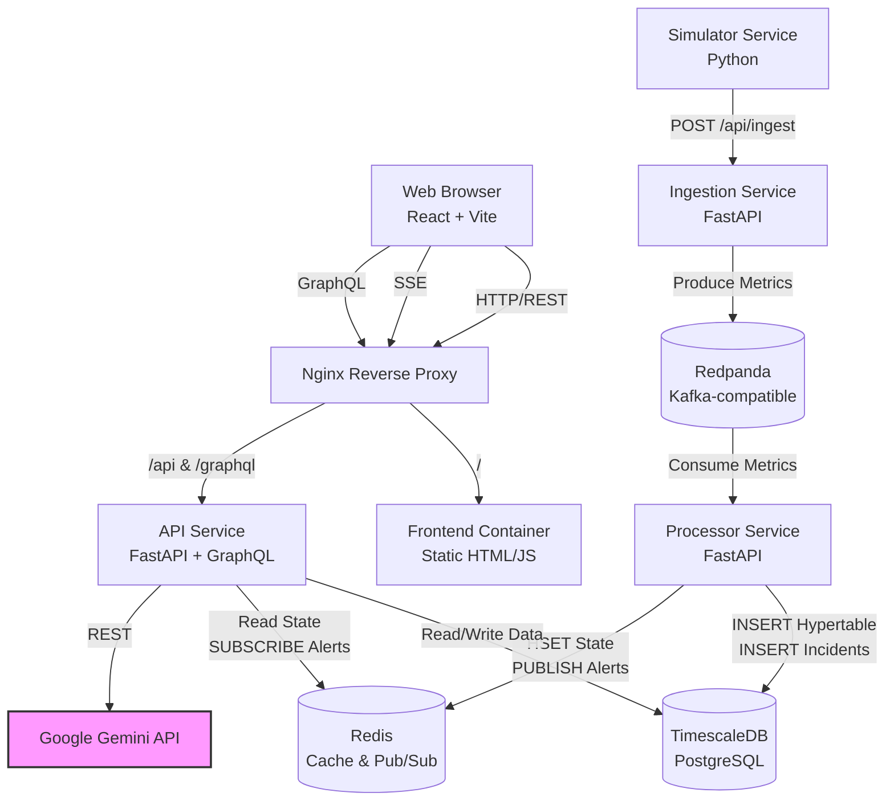
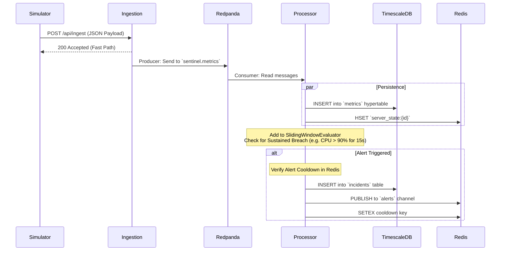
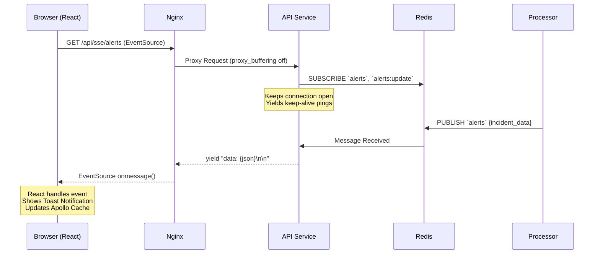
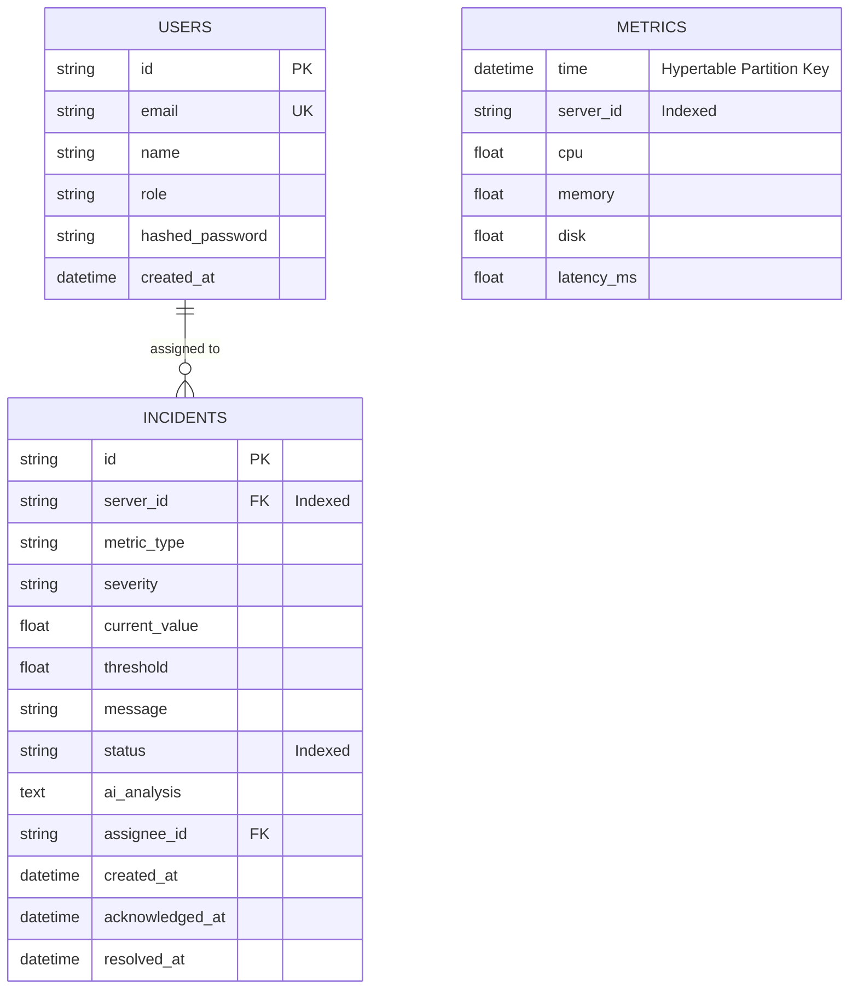

# Sentinel: Master Interview Guide & Architecture Deep-Dive

This document is your comprehensive technical reference for the Sentinel platform. It covers the system architecture, data flows, real-time alerting mechanisms, database schemas, and AI integration. Review this guide before any technical interview to confidently explain your design decisions and implementation details.

---

## 1. System Architecture Overview

Sentinel is built as an event-driven, microservices-oriented architecture. It uses a modern Python/FastAPI backend, a React/TypeScript frontend, and a highly scalable infrastructure layer powered by Redpanda, TimescaleDB, and Redis.



### Communication Protocols
- **Client-to-Server**: REST (Auth, Ingestion), GraphQL (Data querying, Mutations), SSE (Real-time alerts).
- **Service-to-Broker**: Kafka API (via aiokafka) for high-throughput metric ingestion.
- **Service-to-Cache**: Redis RESP protocol for fast state lookups and pub/sub messaging.
- **Service-to-Database**: PostgreSQL wire protocol (via asyncpg and async SQLAlchemy).

---

## 2. Metric Flow – End-to-End Walkthrough

The core capability of Sentinel is processing thousands of metrics per second and evaluating them for anomalies in real-time.



### Processor Internals: The `SlidingWindowEvaluator`
Instead of querying the database for every single metric to check history, the Processor maintains an **in-memory sliding window** using Python `deque`s. 
- It stores the last 30 seconds of data for every server and metric.
- Every time a metric arrives, it evaluates rules (e.g., CPU > 90%).
- An alert only fires if there is a **sustained breach**: meaning *all* data points in the last `N` seconds exceed the threshold, ensuring transient spikes don't cause alert fatigue.

---

## 3. Real-Time Alerting via SSE

Sentinel uses Server-Sent Events (SSE) instead of WebSockets. Because the communication is strictly unidirectional (Server → Browser) for real-time alerts, SSE is lighter, simpler, and utilizes standard HTTP/1.1 connections with built-in browser reconnection logic.



### The Nginx Configuration Trick
For SSE to work through a reverse proxy, you *must* disable buffering. In `nginx.conf`, the API location block explicitly includes:
```nginx
proxy_buffering off;
proxy_cache off;
chunked_transfer_encoding off;
proxy_set_header Connection '';
```
Without this, Nginx would buffer the stream waiting for a complete response, breaking the real-time functionality.

---

## 4. GraphQL API Design

The API relies on Strawberry (a Python GraphQL library based on dataclasses) and Apollo Client on the frontend. 

### Key Queries
1. **`servers`**: Fetches the live dashboard data. Instead of hitting PostgreSQL, it runs an `HGETALL` against Redis `server_state:{id}` keys. This allows the dashboard to be incredibly fast and completely decouples read traffic from the timeseries database.
2. **`metrics(serverId, bucketMinutes)`**: Fetches historical data. This queries TimescaleDB and utilizes the `time_bucket()` function to aggregate thousands of rows into clean interval averages instantly.
3. **`incidents`**: Standard relational query against PostgreSQL (using SQLAlchemy) with eager loading for user assignees.

### Key Mutations
- **`acknowledge_incident` / `resolve_incident` / `assign_incident`**: Updates the PostgreSQL row, and crucially, calls `publish_incident_update()` to push a message to the Redis `alerts:update` channel. This ensures all connected frontend clients instantly see the status change without refreshing.

---

## 5. AI Integration Deep-Dive

Sentinel integrates Google Gemini to provide instant Root Cause Analysis (RCA).

1. **Trigger**: User clicks "Request AI Analysis" on the frontend.
2. **Data Gathering**: The API fetches the incident details (severity, metric type, threshold).
3. **Context Hydration**: The API queries TimescaleDB for the last 5 minutes of metrics for that specific server, extracting the last 20 data points.
4. **Prompting**: It constructs a rigid prompt instructing Gemini to act as an SRE, providing Probable Cause, Impact, Investigation Steps, and Remediation.
5. **Execution & Caching**: It calls `gemini-2.0-flash`. The response is returned to the user, saved permanently to the `incidents.ai_analysis` column in PostgreSQL, and temporarily cached in Redis (`ai:cache:{incident_id}`) with a 15-minute TTL to prevent redundant LLM API calls if multiple users view the same active incident.

---

## 6. Database Schema & Indexes

Sentinel uniquely uses a single PostgreSQL instance for both relational data and time-series data, courtesy of the **TimescaleDB** extension.



### The Hypertable
The `metrics` table is not a standard Postgres table. It is converted into a TimescaleDB **Hypertable**.
- It is automatically partitioned by time.
- As the table grows to millions of rows, inserts remain fast because they only touch the latest memory chunk.
- Index: `CREATE INDEX ON metrics (server_id, time DESC)` — Optimized perfectly for fetching the "recent history" of a specific server.

---

## 7. DevOps & Deployment

### Containerization Strategy
- **Multi-stage Dockerfiles**: Python services use a `builder` stage to compile dependencies (`pip install --prefix=/install`), copying only the compiled artifacts to the final Alpine/Slim image. Node.js does the same for the frontend, resulting in an ultra-slim Nginx final image.
- **Security**: Containers run as non-root users (`groupadd -r sentinel && useradd -r -g sentinel`).
- **Resiliency**: Docker Compose implements `restart: unless-stopped` and complex `healthcheck` dependencies. The `processor` and `ingestion` services will wait in an asynchronous retry loop for Redpanda and TimescaleDB to become healthy before successfully booting.

---

## 8. Tech Decision Rationale

### Why FastAPI over Node.js/Express?
FastAPI leverages Python's massive data science ecosystem. While Sentinel currently only does simple sliding window math, being in Python paves the way for integrating scikit-learn or PyTorch for true anomaly detection (isolation forests, autoencoders) in the future. FastAPI's native async support also handles high-throughput SSE effortlessly.

### Why SSE over WebSockets?
WebSockets are bi-directional. Sentinel's real-time needs are strictly server-to-client (pushing alerts). SSE operates over standard HTTP, doesn't require complex load balancer configurations for connection upgrading, and has native automatic reconnection built into the browser's `EventSource` API.

### Why Redpanda over RabbitMQ or Kafka?
Redpanda is fully Kafka-API compatible but is written in C++ instead of Java/Scala. It does not require Zookeeper or a JVM, drastically reducing the memory footprint and simplifying the Docker Compose setup while maintaining massive throughput capabilities.

### Why TimescaleDB over raw PostgreSQL?
Time-series data degrades standard B-Tree index performance quickly. TimescaleDB automates time-based partitioning (hypertables) keeping insert speeds constant even at billions of rows, and provides native functions like `time_bucket()` which are essential for graphing historical data without complex GROUP BY date math.

---

## 9. Interview Q&A Preparation

**1. How do you handle transient network spikes so they don't cause alert fatigue?**
*Answer:* We use a sliding window evaluator in the Processor service. An alert only fires if a metric sustains a breach across multiple data points over a specific time window (e.g., 15 seconds). A 2-second CPU spike will be ignored. We also utilize a Redis-backed cooldown mechanism to ensure the same alert doesn't fire repeatedly in a short timeframe.

**2. Why decouple ingestion from processing using a message broker?**
*Answer:* To handle traffic bursts and ensure high availability. If the TimescaleDB database goes down for 30 seconds, or the processor needs to be restarted for a deployment, the Ingestion service can still accept incoming metrics with 200 OK responses. Redpanda buffers the data on disk, and the processor simply catches up once it's back online.

**3. Describe your real-time notification architecture.**
*Answer:* The processor evaluates metrics and publishes JSON to a Redis Pub/Sub channel. The API service subscribes to this channel asynchronously. When a message arrives, the API pushes it to the React frontend via Server-Sent Events (SSE). The frontend intercepts this stream, pops a toast notification, and updates the Apollo GraphQL cache seamlessly.

**4. How does the dashboard load so fast if you are ingesting thousands of metrics a second?**
*Answer:* The dashboard does not query the SQL database. The Processor service updates a Redis Hash (`HSET`) for every server with its latest metric values. When the frontend requests the dashboard data via the GraphQL `servers` query, the API simply reads the current state from RAM in Redis, achieving sub-millisecond response times.

**5. How are you injecting context into your AI analysis?**
*Answer:* Before calling the Gemini API, our backend queries the TimescaleDB hypertable for the last 5 minutes of metrics for the affected server. We format these recent metrics into a time-series string and inject it into a strict system prompt, asking the AI to correlate the incident with the recent metric trends to provide actionable root-cause analysis. We then cache the result in Redis to prevent duplicate LLM processing.

**6. What happens if Redpanda isn't ready when the ingestion service boots?**
*Answer:* The Ingestion service's FastAPI lifespan event utilizes an asynchronous retry loop with exponential backoff when instantiating the `AIOKafkaProducer`. It runs in a background task so the `/health` endpoint can immediately start returning 200 OK (allowing Docker to mark it healthy), while it safely waits for the broker to accept connections.

**7. How would you scale the Processor service?**
*Answer:* Currently, it's a single consumer. To scale, I would increase the partition count on the Redpanda topic (e.g., to 5 partitions based on `server_id` as the partition key). Then, I would deploy 5 replicas of the Processor service sharing the same Kafka Consumer Group. Redpanda would automatically distribute the partitions among the replicas, allowing horizontal scaling of the evaluation logic.

**8. Why use GraphQL instead of REST for the frontend API?**
*Answer:* The dashboard requires varying shapes of data—sometimes just server statuses, other times deeply nested incident histories with assigned user metadata. GraphQL prevents over-fetching and under-fetching. Furthermore, Apollo Client provides an excellent normalized cache on the frontend, making state management highly predictable.

**9. Explain `proxy_buffering off` in your Nginx config.**
*Answer:* Standard reverse proxies buffer backend responses until a chunk is full before sending it to the client, which improves throughput for static files. However, for SSE, we need data pushed immediately to the client the millisecond it's generated. Disabling buffering ensures the HTTP stream stays open and data flows instantly.

**10. How do you ensure your Docker images are production-ready?**
*Answer:* We use multi-stage builds to exclude build tools (like `gcc` or `npm`) from the final images, significantly reducing attack surface and size. We also explicitly create and use a non-root user (`sentinel`) to run the application processes, mitigating privilege escalation risks if a container is compromised.

*(Note: Prepare to dive deeper into any of these 10 core concepts based on the interviewer's background).*

---

## 10. Summary “Elevator Pitch”

> "Sentinel is a real-time infrastructure monitoring platform I built to handle high-throughput telemetry data. It ingests server metrics via a FastAPI microservice, buffers them through a Redpanda event stream, and processes them using an in-memory sliding window for sustained anomaly detection. The system persists time-series data to TimescaleDB for historical analysis, while mirroring live state to Redis for ultra-fast dashboard queries. When an anomaly is detected, alerts are pushed instantly to a React frontend via Server-Sent Events, and on-call engineers can trigger an automated root-cause analysis powered by the Google Gemini API, complete with context-aware remediation steps."
